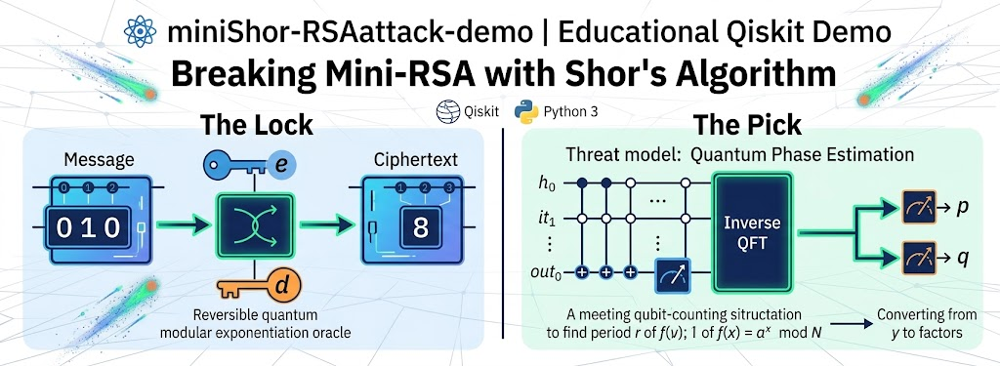

# ⚛️ miniShor-RSAattack-demo

#QuantumComputing #Qiskit #CyberSecurity #InfoSec #Shor #RSA

Ever wondered how Shor's Algorithm breaks RSA in practice?
We put together an end-to-end, educational Qiskit implementation showing both sides of the coin:

🔒 Building quantum modular exponentiation for RSA encryption/decryption
🔓 Using Quantum Phase Estimation (QPE) to factor $N$, find $d$, and decrypt ciphertext

Explore the code & quantum circuits on GitHub! 👇
🔗 [github](https://github.com/bkornpob/miniShor-RSAattack-demo)

---



---

A hands-on, educational implementation of **Mini-RSA Encryption/Decryption** and **Shor's Factoring Attack** using quantum circuits in Qiskit and Python 3.

> **Scope:** a teaching demo at toy scale (`N = 15, 21, 33`). It shows the *mechanism* of the attack, not a scalable one. See [Limitations](#-limitations).

---

## 📌 Repository Overview

This repository demonstrates the end-to-end cryptographic pipeline and quantum attack vector for RSA public-key systems:

1. **`page-1-example-1-miniRSA.ipynb`**: Demonstrates quantum modular exponentiation oracles for valid RSA encryption ($C \equiv M^e \pmod N$) and decryption ($M \equiv C^d \pmod N$).
2. **`page-2-mini-Shor-example-1.ipynb`**: Demonstrates the classical-quantum hybrid attack where an eavesdropper uses Quantum Phase Estimation (QPE) to recover period $r$, factor $N = p \cdot q$, reconstruct private key $d$, and decrypt plaintext $M$.

Read them in order: page-1 builds the lock, page-2 picks it.

---

## 📐 Architecture & Execution Flow

### 1. Quantum Mini-RSA (`page-1`)
* **Reversible Oracle:** Implements $U_k: \vert{}x\rangle\vert{}y\rangle \to \vert{}x\rangle\vert{}y \oplus (x^k \bmod N)\rangle$ using multi-controlled $X$ gates.
* **Pipeline:** $M_{\text{bits}} \to M_{\text{int}} \to \text{Pad} \to \text{Encrypt } (U_e) \to \text{Transmit } C \to \text{Decrypt } (U_d) \to \text{Depad} \to M_{\text{bits}}$.

### 2. Mini-Shor Attack (`page-2`)
* **Threat model:** the attacker sees only the public package `(e, N, C, padding)`. `p` and `q` exist only in the sender/test harness. The true message is used only to grade the result.
* **Quantum step (only one):** phase estimation of $U\vert{}y\rangle = \vert{}a\,y \bmod N\rangle$ with $t = 2n$ counting qubits and $n = \lceil\log_2 N\rceil$ work qubits, to find the period $r$ of $f(x)=a^x \bmod N$.
* **Everything else is classical:**

```
pick a (1 < a < N)
   -> [quantum] phase estimation -> measured y
   -> continued fractions: y/2^t ~ s/r -> candidate r
   -> check: a^r = 1, r even, a^(r/2) != ±1 (mod N)
   -> factor: (p, q) = gcd(a^(r/2) ± 1, N)
   -> phi = (p-1)(q-1) -> d = e^-1 mod phi
   -> M_padded = C^d mod N -> depad -> M
```

* **Generic for any small `N`:** the multiplier unitary is built from a permutation matrix, `n`, `t` and the base pool are computed by the code, and padding is a plug-in (`DEPAD[protocol]`).

---

## 🗂️ Repository Structure

```
.
├── page-1-example-1-miniRSA.ipynb (and pdf)      # quantum RSA encrypt/decrypt
├── page-2-mini-Shor-example-1.ipynb (and pdf)    # Shor attack, theory notes, post-quantum discussion
├── README.md (and LICENSE)
└── figures                 # saved circuit drawings, e.g. shor_N33.png
```

---

## 🚀 Getting Started

### Requirements
* Python 3.10+
* `qiskit`, `qiskit-aer`, `numpy`, `matplotlib`, `pylatexenc` (for `qc.draw('mpl')`)
* Optional, for real hardware: `qiskit-ibm-runtime` and an IBM Quantum account

```bash
pip install qiskit qiskit-aer numpy matplotlib pylatexenc jupyter
# optional
pip install qiskit-ibm-runtime
```

> Pin the versions you tested with (e.g. via `requirements.txt`). Qiskit's API changes between releases, for example `QFTGate` and the Runtime `SamplerV2`.

### Run
```bash
jupyter lab
```
Open `page-1` first, then `page-2`, and run the cells top to bottom.

---

## 🧪 Test Cases

Each case is `(M_bits, p, q, e)`:

| Field | Meaning |
|---|---|
| `M_bits` | plaintext bit string (public length `m = len(M_bits)`) |
| `p, q` | secret primes, `N = p·q` (**harness only**) |
| `e` | public exponent, needs `gcd(e, (p-1)(q-1)) = 1` |

```python
testcases = [("010", 3, 5, 3),
             ("011", 3, 11, 3),
             ("011010", 3, 11, 3)]
```

Requirement: the padded message must satisfy `M < N`. Otherwise decryption returns `M mod N` and the case mismatches by design. For example, the 9-bit message with `N = 143` gives `203 mod 143 = 60`.

### Sample run (local Aer simulator)

| Case | N | Result | Time | Quantum step ran? |
|---|---|---|---|---|
| `("010",3,5,3)` | 15 | OK | ~0 s | likely no (gcd shortcut) |
| `("011",3,11,3)` | 33 | OK | ~22 s | yes |
| `("011010",3,11,3)` | 33 | OK | ~0 s | no (gcd shortcut) |

> ⚠️ **gcd shortcut:** if a random base `a` shares a factor with `N`, the factors fall out classically and no circuit runs. At small `N` this is common (about 40% of bases for `N = 33`), so a fast "OK" does not prove the quantum step executed. To benchmark the quantum part, skip non-coprime bases, i.e. use `allow_gcd_shortcut=False` if you kept that flag.

Larger `N` (e.g. `143`) failed in the local simulator, most likely because of transpiling large dense unitaries. See the limitations below.

---

## 🖼️ Circuit Output

`attack` returns the circuit of the successful quantum run, or `None` if the gcd shortcut was used.

```python
got, info, qc = attack(*pkg)
if qc is not None:
    qc.draw('mpl', fold=-1, filename=f"shor_N{pkg[1]}.png")
```

Each controlled multiplier appears as one labeled box (`a^power mod N`). Powers where `a^(2^j) ≡ 1 (mod N)` are skipped because they are the identity.

---

## 🖥️ Running on IBM Quantum Hardware (optional)

* Only **`N = 15`** is realistic on current noisy devices.
* Use the hardware runner with `t = 3` and a small base budget, since each base is a queued job.
* Validate first with `AerSimulator.from_backend(backend)` to get the device noise model locally.
* Classical verification (`p·q = N`, re-encryption of `M_padded` gives `C`) is noise-proof, so noise can cause a failed run but never a wrong answer.

---

## ⚠️ Limitations

* **Not scalable:** the multiplier is a full `2^n × 2^n` permutation matrix, so cost grows exponentially in `n`. Scalable Shor uses arithmetic circuits (Beauregard-style QFT adders, `O(n³)` gates) and iterative phase estimation.
* **Small-N demos are special:** hand-compiled or structure-exploiting circuits for `N = 15` do not demonstrate scalable Shor (Smolin, Smith & Vargo, 2013).
* **Hardware:** decoherence and gate error erase the interference pattern long before `N ≈ 143`.
* **Padding:** only `identity` padding is implemented. New schemes plug in through the `DEPAD` registry. Real RSA padding (OAEP) does not defend against Shor, because once `d` is known, depadding is public.

---

## 🔐 Post-Quantum Context

Shor breaks schemes that rest on a hidden period in an abelian group: RSA, Diffie-Hellman, DSA, and elliptic-curve cryptography. Symmetric ciphers and hashes are only affected by Grover's quadratic speedup, so larger keys suffice. Lattice-, hash- and code-based schemes standardized by NIST are the migration targets. `page-2` has a section on this. Check standards status against current sources, since it keeps changing.

---

## 📚 References

* P. W. Shor (1994). *Algorithms for quantum computation: discrete logarithms and factoring.*
* S. Beauregard (2003). *Circuit for Shor's algorithm using 2n+3 qubits.*
* J. Smolin, G. Smith, A. Vargo (2013). *Oversimplifying quantum factoring.* Nature 499.
* C. Gidney, M. Ekerå (2021). *How to factor 2048 bit RSA integers in 8 hours using 20 million noisy qubits.* Quantum 5, 433.
* C. Gidney (2025). *How to factor 2048 bit RSA integers with less than a million noisy qubits.*=

---

## 👤 Author

Dr. Kornpob Bhirombhakdi, 2026
(feat. bots)

## 📄 License

MIT License. See [LICENSE](LICENSE).